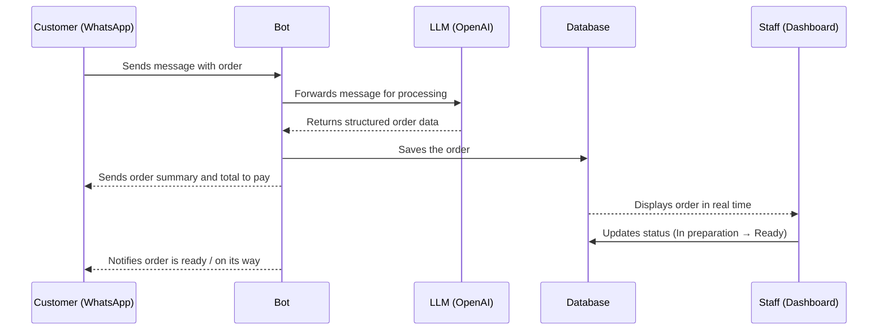

# Product Requirements Document (PRD)
## WhatsApp Order Automation System

---

## 1. Context and Problem

A fast food restaurant needs to automate its order-taking process via WhatsApp. Currently, the staff member handling orders also manages payments, making it difficult to respond quickly during peak hours.

**Main problem:** The average response time is 10 minutes, and can increase depending on the complexity of the conversation. This causes customer frustration and lost sales.

---

## 2. Goal

Automate order reception and management through a WhatsApp bot integrated with an OpenAI LLM, so customers can place orders autonomously, receive a summary with the total amount to pay, and allow staff to view and manage orders in real time.

---

## 3. System Users

| Actor | Description |
|---|---|
| **Customer** | Places orders through WhatsApp |
| **Staff** | Views, prepares, and updates order status through a web interface |

---

## 4. Main System Flow

### 4.1 Flow Description

1. The customer sends a message to the WhatsApp bot.
2. The bot receives the message and sends it to the LLM to extract the necessary information to create the order.
3. The LLM processes the natural language message, extracts the order data, and returns it to the bot.
4. The bot creates the order in the database.
5. The bot sends the customer an order summary with the total amount to pay.
6. Staff views the order on screen in real time and prepares it.
7. Staff marks the order as completed and the bot notifies the customer that their order is ready for pickup or on its way if it's for delivery.

### 4.2 Flow Diagram



---

## 5. Order Structure

Each order must contain:

- The requested items with their respective modifications. Examples:
  - 1 burger without onion
  - 1 soda without ice
  - 1 serving of fries with cheese
  - 1 hot dog without mustard
- Delivery mode: **pick up** or **deliver**
- Customer name the order belongs to

---

## 6. Order Statuses

```
Pending → In preparation → Ready to deliver → Delivered
                                             ↘ Cancelled
```

| Status | Description |
|---|---|
| **Pending** | The order was received and registered |
| **In preparation** | Staff started preparing the order |
| **Ready to deliver** | The order is ready (applies to both pick up and delivery) |
| **Delivered** | The order was delivered to the customer |
| **Cancelled** | The order was cancelled |

---

## 7. Functional Requirements

### 7.1 WhatsApp Bot
- Connection to the WhatsApp Business API.
- Natural language processing via an OpenAI LLM to extract order information.
- Sending an order summary with the total amount to pay to the customer.
- Notifying the customer when their order is ready or on its way.
- Option for the customer to view the menu and prices (via link or direct bot message).
- Option for the customer to request human assistance, which disables the bot in their conversation and notifies staff.

### 7.2 Bot Management
- Activating and deactivating the bot **globally** (for all customers) or **individually** per customer.
- This allows staff to take manual control of conversations when necessary.

### 7.3 Menu Management
- Staff can activate or deactivate individual menu products.
- Deactivated products will not be offered by the bot to the customer during the ordering process.
- The goal is to prevent cancellations due to stock shortage: if a product runs out, staff deactivates it and the bot automatically stops considering it.

### 7.4 Web Interface for Staff
- Real-time order visualization.
- Order status updates.
- Bot activation/deactivation control (global and individual per customer).
- Menu product activation and deactivation.
- Staff authentication.
- New order notifications via sound and/or vibration.

### 7.5 Database
- Storage of orders, menu, and customers.

---

## 8. Non-Functional Requirements

### 8.1 Performance
- The system must be fast and efficient, capable of handling a high volume of simultaneous orders.

### 8.2 Usability
- The interface must be simple and intuitive for staff without technical knowledge.
- Responsive design optimized for Android devices with small screens.

### 8.3 Accessibility
- High contrast mode to facilitate use by staff with vision problems.
- Large font size in the interface.

### 8.4 Real-Time
- Orders must be updated and displayed in real time on the staff dashboard.

---

## 9. Constraints and Considerations

- The system will be operated primarily from an Android phone.
- The staff who will use it have no computer knowledge, so the user experience is a critical priority.
- One staff member has vision problems, making visual accessibility support mandatory.
